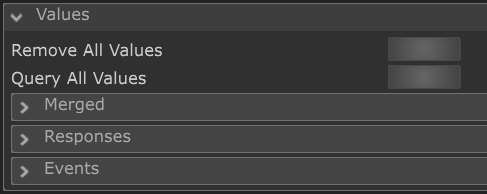

# OBS Websocket Advanced module for Chataigne
An advanced module to use OBS Websocket V5 within the [Chataigne](http://benjamin.kuperberg.fr/chataigne/en) Software.

This module tries to use the least ammount of "manual work", and build on the official websocket protocol definition as much as possible.

By generating code, and using logic that parses the official protocol, I hope it will be easier to maintain.

<h1>Table Of contents</h1>

<!-- TOC -->
* [OBS Websocket Advanced module for Chataigne](#obs-websocket-advanced-module-for-chataigne)
* [Prerequisites](#prerequisites)
* [How to use](#how-to-use)
  * [Values](#values)
  * [Requests](#requests)
  * [Contributing](#contributing)
  * [Acknowledgments](#acknowledgments)
<!-- TOC -->

# Prerequisites
 * [Chataigne](https://benjamin.kuperberg.fr/chataigne/en) Version: 1.9.24+
 * [OBS](https://obsproject.com) Version: 28+

# How to use
 * Enable the Websocket server in OBS (Tools -> Websocket Server Settings) 
 * Add this module to Chataigne, and set up the Websocket connection

## Values
This module automatically parses all the events and responses that are coming from OBS, and
puts them under three categories:

 * Values / **Requests**: This is where the responses are put for any request that is being sent
 * Values / **Events**: This is where the event data is put for any event that is coming in
 * Values / **Merged**: These can be coming from both of the above sources and this is where they are mapped together.

For example, the `merged.programScene.sceneName` might come from any of these messages: GetSceneList (r), CurrentProgramSceneChanged (r), GetCurrentProgramScene (e) 
but in any of these inputs it will be also mapped to the mentioned key.

## Requests
You may send a raw websocket message, if you are sure of what you are doing with the Templates/+/Raw WS Message.

You may send a raw OBS message, if you are sure of what you are doing with the Templates/+/Raw OBS Message.
For more info on that, check out the official protocol [OBS Websocket Protocol Definition](https://github.com/obsproject/obs-websocket/blob/master/docs/generated/protocol.md#requests).

And you may send any other requests that are pre-mapped for you based on the OBS websocket API.

<!-- Contributing -->
## Contributing
Contributions are what make the open source community such an amazing place to learn, inspire, and create. Any contributions you make are **greatly appreciated**.

If you have a suggestion that would make this better, please fork the repo and create a pull request. You can also simply open an issue with the tag "enhancement".
Don't forget to give the project a star! Thanks again!

1. Fork the Project
2. Create your Feature Branch (`git checkout -b feature/AmazingFeature`)
3. Commit your Changes (`git commit -m 'Add some AmazingFeature'`)
4. Push to the Branch (`git push origin feature/AmazingFeature`)
5. Open a Pull Request

## Acknowledgments
This module is almost rebuilt from the scratch, but it is originally forked from the awesome work of [Edrig](https://github.com/Edrig/OBS-Websocket-Chataigne-Module)!

Thanks to [Benjamin Kuperberg ](https://benjamin.kuperberg.fr/) for his amazing work of art, [Chataigne](http://benjamin.kuperberg.fr/chataigne/en).
